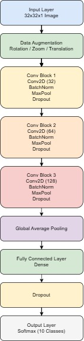
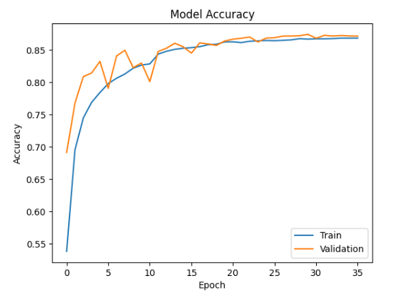

# Fashion MNIST Image Classification using Deep CNN

This project implements a **Deep Convolutional Neural Network (CNN)** to classify clothing images from the Fashion MNIST dataset.  
The goal of this project is to build an improved deep learning model capable of accurately classifying different categories of fashion items.

---

## Dataset

The model is trained using the **Fashion MNIST dataset**, which is a well-known benchmark dataset for image classification.

Dataset Details:

- Total Images: 70,000
- Training Images: 60,000
- Test Images: 10,000
- Image Size: 28 × 28 grayscale
- Number of Classes: 10

Classes:

1. T-shirt/top  
2. Trouser  
3. Pullover  
4. Dress  
5. Coat  
6. Sandal  
7. Shirt  
8. Sneaker  
9. Bag  
10. Ankle boot  

---

## Project Workflow

The overall workflow of the project includes the following steps:

1. Data Loading  
2. Data Preprocessing  
3. Image Resizing  
4. Data Augmentation  
5. CNN Model Architecture  
6. Model Training  
7. Model Evaluation  
8. Performance Visualization  

---

## Data Preprocessing

The following preprocessing steps were applied:

- Pixel normalization (0–255 → 0–1)
- Image resizing to **32 × 32**
- Reshaping images for CNN input
- Data augmentation techniques including:
  - Random rotation
  - Random zoom
  - Random translation

These steps help improve the generalization capability of the model.

---

## Model Architecture

  

---

## Training Configuration

Optimizer: Adam  
Loss Function: Sparse Categorical Crossentropy  
Metrics: Accuracy  

Additional training techniques used:

- Early Stopping
- Reduce Learning Rate on Plateau
- Dropout Regularization
- L2 Weight Regularization

---

## Model Evaluation

The model performance was evaluated using:

- Accuracy
- Confusion Matrix
- Classification Report
- Training and Validation Curves

Evaluation Metrics:

- Precision
- Recall
- F1-score

These metrics provide a detailed understanding of the model’s classification performance.

---

## Visualization

The following visualizations were generated:

- Training vs Validation Accuracy
- Training vs Validation Loss
- Confusion Matrix Heatmap

These plots help analyze model learning behavior and detect overfitting.

---

## Technologies Used

- Python
- TensorFlow / Keras
- NumPy
- Matplotlib
- Seaborn
- Scikit-learn

---

## Model Accuracy

  

## Confusion Matrix

  

